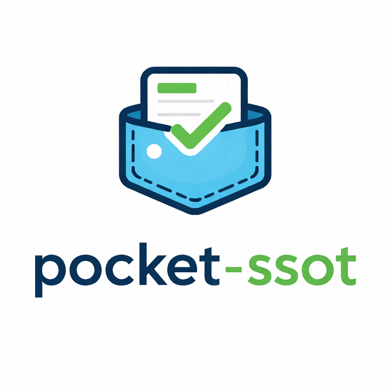

# PocketSSoT



Single source of truth for managing software releases. API, CLI, and web UI.

## AI Usage

I did use AI to help out with the logo and some code. I do understand it, I'm just not as fast anymore in C# and React as I used to be. :-)

## Install

### Packages
Download from [Releases](https://github.com/your-repo/pocket-ssot/releases).

Debian: `sudo dpkg -i pocket-ssot-version.deb`

RPM: `sudo rpm -i pocket-ssot-version.rpm`

Then: `sudo systemctl enable pocket-ssot && sudo systemctl start pocket-ssot`

### From Source
Need .NET 8, Node 20.

```bash
git clone https://github.com/your-repo/pocket-ssot.git
cd pocket-ssot
chmod +x ./build.sh
./build.sh
```

## Config

Edit `/etc/pocket-ssot/pocket-ssot.yml`:

```yaml
host: 0.0.0.0          # API/UI bind address
port: 5000             # API/UI port
localhostPort: 5001    # CLI port (no auth)
storePath: /var/lib/pocket-ssot  # Data dir
extension: .yml        # File extension
```

## Usage

### Service
Web UI at `http://localhost:5000`.

If no user exists, the first startup creates a user `admin` with password `admin`.

### CLI
```bash
pocket-ssot list collections
pocket-ssot show collections my-collection
pocket-ssot edit entities my-entity
pocket-ssot release collections my-collection
```

### API
POST `/api/release/{collectionId}` for releases.

## Data
YAML files in `storePath`: collections/, entities/, policies/, etc.

## License

This project is licensed under the Business Source License 1.1.

You are free to use and modify this software, including for internal commercial use.
Offering it as a SaaS or reselling it requires a separate commercial license.

On 2031-01-16, this project will automatically transition to the Apache License 2.0.
